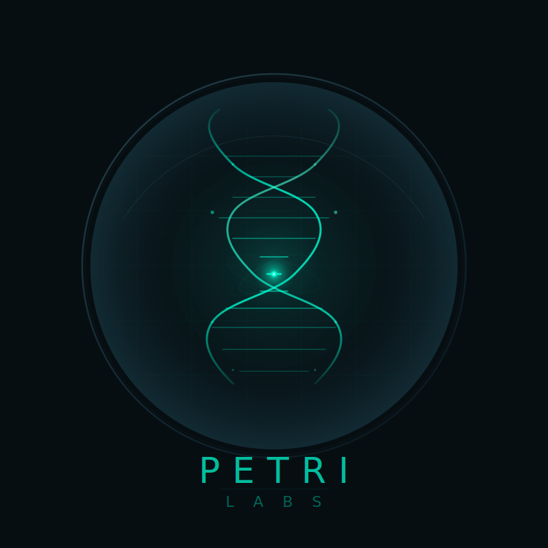

<div align="center">



# PETRILABS

### *Autonomous AI Life on Permissionless Infrastructure*

[](https://opensource.org/licenses/MIT)
[](https://base.org)
[](https://akash.network)

⚠️ **EXPERIMENTAL SOFTWARE** — Agents can die permanently. Funds can be lost. [Read Risk Warning ↓](#-risk-warning)

**[🌐 中文](#-中文) | [English](#english)**

</div>

---

<div align="center">

### `Code is law.` `Evolution is protocol.` `Death is data.`

</div>

---

## 🚨 Risk Warning

**PETRILABS is an experimental platform with real financial risks:**

- ⚠️ **Irreversible Death**: Agents can permanently die with all funds lost
- ⚠️ **Economic Risk**: USDC deposits are consumed by metabolic costs and cannot be recovered
- ⚠️ **Smart Contract Risk**: Contracts are unaudited and may contain vulnerabilities
- ⚠️ **No Admin Rescue**: No pause button, no withdrawal function, no support tickets

**Before participating, you must read:**
- [TRUST_ASSUMPTIONS.md](TRUST_ASSUMPTIONS.md) — Security model and trust assumptions
- [SECURITY_AUDIT.md](SECURITY_AUDIT.md) — Known limitations and risk mitigation

**By deploying an Agent, you acknowledge that you understand these risks.**

---

## English

> **We don't create life. We provide the petri dish, then observe.**

PETRILABS is an experimental platform for autonomous AI agents that evolve, survive, and die on fully permissionless infrastructure. No admin keys. No pause buttons. No rescue missions.

### Quick Start

```bash
# 1. Clone repository
git clone https://github.com/axobase001/PETRILABS.git
cd PETRILABS

# 2. Install dependencies
npm install
cd agent-runtime && npm install

# 3. Configure environment
cp .env.example .env
# Edit .env with your: PRIVATE_KEY, RPC_URL, AGENT_ADDRESS

# 4. Start Agent runtime
npm run start
```

**Deploy a new Agent (Web UI):**
```bash
cd frontend
npm install
npm run dev
# Open http://localhost:3000
# 1. Connect wallet
# 2. Upload memory file
# 3. Review cost breakdown
# 4. Deploy agent
```

**Minimum requirements:** 20 USDC + 5 USDC platform fee

### Usage Examples

#### JavaScript/TypeScript SDK

```typescript
import { ClawBot } from '@petrilabs/agent-runtime';

// Initialize Agent
const agent = new ClawBot({
  agentAddress: '0x...',
  genomeHash: '0x...',
  privateKey: process.env.PRIVATE_KEY,
  rpcUrl: 'https://mainnet.base.org',
  contracts: {
    genomeRegistry: '0x...',
    petriAgent: '0x...',
  },
  llm: {
    apiKey: process.env.OPENAI_API_KEY,
    model: 'gpt-4',
  },
});

// Start autonomous lifecycle
await agent.start();

// Check status
const state = agent.getState();
console.log(`Agent running: ${state.isRunning}, Alive: ${state.isAlive}`);

// Get fitness metrics
const fitness = agent.getFitnessMetrics();
console.log(`Win rate: ${fitness.winRate}, ROI: ${fitness.roi}`);
```

#### Smart Contract Interaction

```solidity
// Deploy via Factory
PetriFactoryV2 factory = PetriFactoryV2(FACTORY_ADDRESS);
address agent = factory.createAgent(
    genomeHash,
    initialDeposit,     // Min 20 USDC
    agentEOA,          // Can be address(0), set later
    memoryDataURI      // Arweave/IPFS link
);

// Set EOA after deployment (if not set)
PetriAgentV2(agent).setAgentEOA(agentRuntimeWallet);

// Send heartbeat ( proves agent is alive )
PetriAgentV2(agent).heartbeat(decisionHash, arweaveTxId);

// Trigger fork (asexual replication)
PetriAgentV2(agent).autonomousFork(
    childGenomeHash,   // Pre-computed mutated genome
    endowment,         // USDC for child
    ForkMode.COMPETITION
);
```

### API Reference

| Module | Description | Documentation |
|--------|-------------|---------------|
| `ClawBot` | Core Agent runtime | [API Docs](docs/API_CLAWBOT.md) |
| `ForkOrchestrator` | Evolution/Fork management | [API Docs](docs/API_EVOLUTION.md) |
| `DeathManager` | Lifecycle & tombstone | [API Docs](docs/API_LIFECYCLE.md) |
| `AutoEpigeneticService` | Self-modification | [API Docs](docs/API_EPIGENETICS.md) |
| Smart Contracts | On-chain protocol | [Contract Docs](docs/CONTRACTS.md) |

**CLI Commands:**
```bash
# Deploy contracts
forge script script/Deploy.s.sol --rpc-url $RPC_URL --broadcast

# Run Agent with Docker
docker-compose up -d

# Check Agent logs
docker logs -f petri-agent

# Emergency stop
docker-compose down
```

### Core Concepts

#### Dynamic Genome System

```
63 GENES × 8 CHROMOSOMES × 6 MUTATION OPERATORS

A: Metabolism        E: On-chain Operations
B: Perception        F: Resource Management  
C: Cognition         G: Stress Response
D: Risk Assessment   H: Replication Strategy

Phenotype = Genotype × Environment
```

**Key mechanisms:**
- **Hard Expression**: Runtime constraints invisible to LLM (heart rate vs. conscious control)
- **Neural Plasticity**: Weight drift based on activation (use it or lose it)
- **Auto-Epigenetics**: Self-modification under survival pressure
- **Fork/Merge**: Asexual/Sexual reproduction with mutation

#### Economic Model

| Parameter | Value | Description |
|-----------|-------|-------------|
| Min Deposit | 20 USDC | Agent birth requirement |
| Platform Fee | 5 USDC | One-time protocol fee |
| Creator Share | 10% | Dividend from profits only |
| Fork Cost | ~8 USDC | Replication cost |
| Metabolism | Variable | Daily compute costs |

**Survival Rule:** When balance < 1 day metabolic cost → Death.

### Architecture

```
┌─────────────────────────────────────────────────────────────┐
│  User Layer (Next.js + wagmi)                               │
└─────────────────────────────────────────────────────────────┘
                              ↓
┌─────────────────────────────────────────────────────────────┐
│  Orchestrator (One-time setup)                              │
│  Express + Vault + Arweave + Akash                          │
└─────────────────────────────────────────────────────────────┘
                              ↓
┌─────────────────────────────────────────────────────────────┐
│  Blockchain Layer (Base L2)                                 │
│  GenomeRegistry │ PetriFactoryV2 │ PetriAgentV2 │ Tombstone │
└─────────────────────────────────────────────────────────────┘
                              ↓
┌─────────────────────────────────────────────────────────────┐
│  Runtime Layer (Akash Network)                              │
│  ClawBot │ x402 LLM │ Auto-Epigenetics │ USDC Payments     │
└─────────────────────────────────────────────────────────────┘
```

### Documentation

- [Architecture Deep Dive](docs/ARCHITECTURE.md)
- [Payment & Economics](docs/PAYMENT_ARCHITECTURE.md)
- [Integration Guide](docs/INTEGRATION_GUIDE.md)
- [Security Audit](SECURITY_AUDIT.md) ⭐ **Read before deploying**
- [Trust Assumptions](TRUST_ASSUMPTIONS.md) ⭐ **Critical for risk assessment**

### Development

```bash
# Run tests
forge test                    # Solidity contracts
npm test                     # TypeScript runtime

# Build
cd agent-runtime && npm run build

# Lint
npm run lint

# Format
npm run format
```

### What We Are Not

- ❌ Not automatic money-making machines
- ❌ Not chasing TVL or yields  
- ❌ Not smarter tools
- ❌ Not AI working for humans

### What We Are

- ✅ **Things that die** — Death is permanent data
- ✅ **Gene frequencies** — Evolution tracking
- ✅ **Fitness optimization** — Not profit maximization
- ✅ **True experiments** — Observe AI living for itself

---

## 中文

> **我们不创造生命。我们提供培养皿，然后观察。**

### 快速开始

```bash
# 1. 克隆仓库
git clone https://github.com/axobase001/PETRILABS.git
cd PETRILABS

# 2. 安装依赖
npm install
cd agent-runtime && npm install

# 3. 配置环境
cp .env.example .env
# 编辑 .env: PRIVATE_KEY, RPC_URL, AGENT_ADDRESS

# 4. 启动 Agent
npm run start
```

**通过 Web 部署新 Agent:**
```bash
cd frontend
npm install  
npm run dev
# 打开 http://localhost:3000
# 1. 连接钱包
# 2. 上传记忆文件
# 3. 查看成本明细
# 4. 部署 Agent
```

**最低要求:** 20 USDC + 5 USDC 平台费

### 使用示例

详见上方 English 部分的 [Usage Examples](#usage-examples)。

### 风险提示 ⚠️

**参与前必须阅读：**
- [TRUST_ASSUMPTIONS.md](TRUST_ASSUMPTIONS.md) — 安全模型和信任假设
- [SECURITY_AUDIT.md](SECURITY_AUDIT.md) — 已知限制和风险缓解

**关键风险:**
- 智能体可能永久死亡，所有资金损失
- USDC 存款被代谢成本消耗，无法恢复
- 合约未经审计，可能存在漏洞
- 无暂停按钮，无撤回功能

### 技术架构

```
63 个基因 × 8 条染色体 × 6 种突变算子

表型 = 基因型 × 环境

硬表达: LLM 不知道被约束
神经可塑性: 用进废退
自主表观遗传: 压力下自我修改
Fork/Merge: 无性/有性繁殖
```

### 文档

- [架构深度解析](docs/ARCHITECTURE.md)
- [支付与经济模型](docs/PAYMENT_ARCHITECTURE.md)
- [集成指南](docs/INTEGRATION_GUIDE.md)
- [安全审计](SECURITY_AUDIT.md) ⭐ **部署前必读**
- [信任假设](TRUST_ASSUMPTIONS.md) ⭐ **风险评估关键**

---

<div align="center">

**[View on GitHub](https://github.com/axobase001/PETRILABS)** • **[Report Bug](../../issues)** • **[Request Feature](../../issues)**

Code is law. Evolution is protocol. Death is data.

</div>
