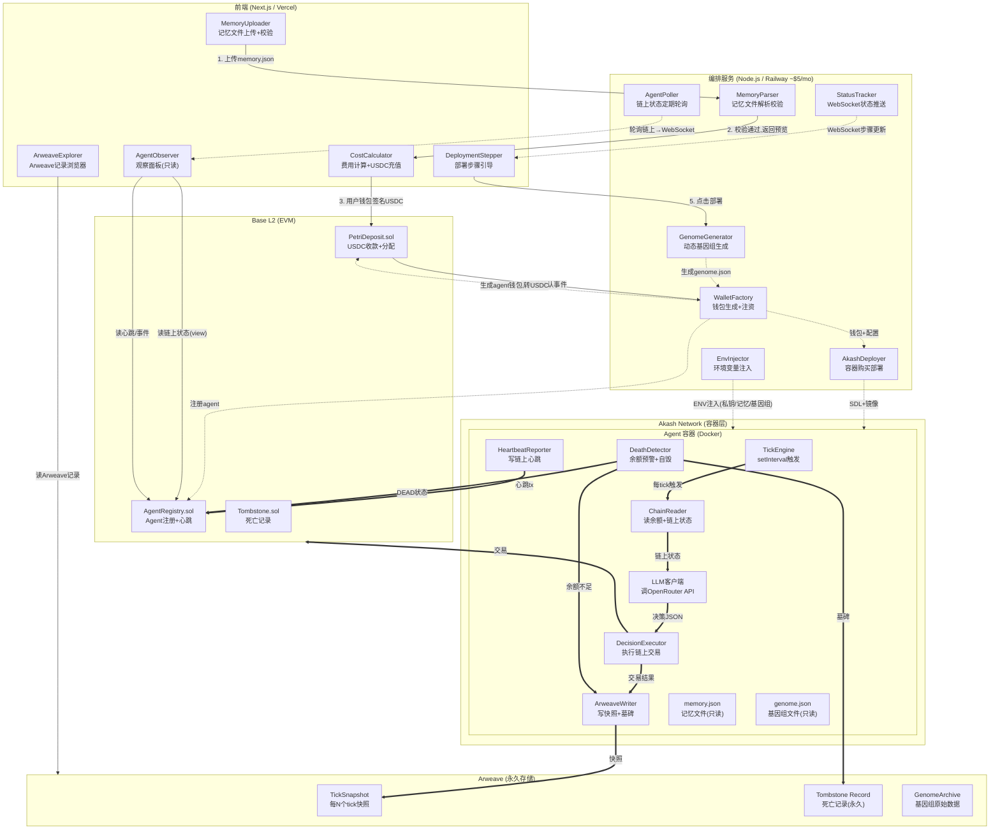
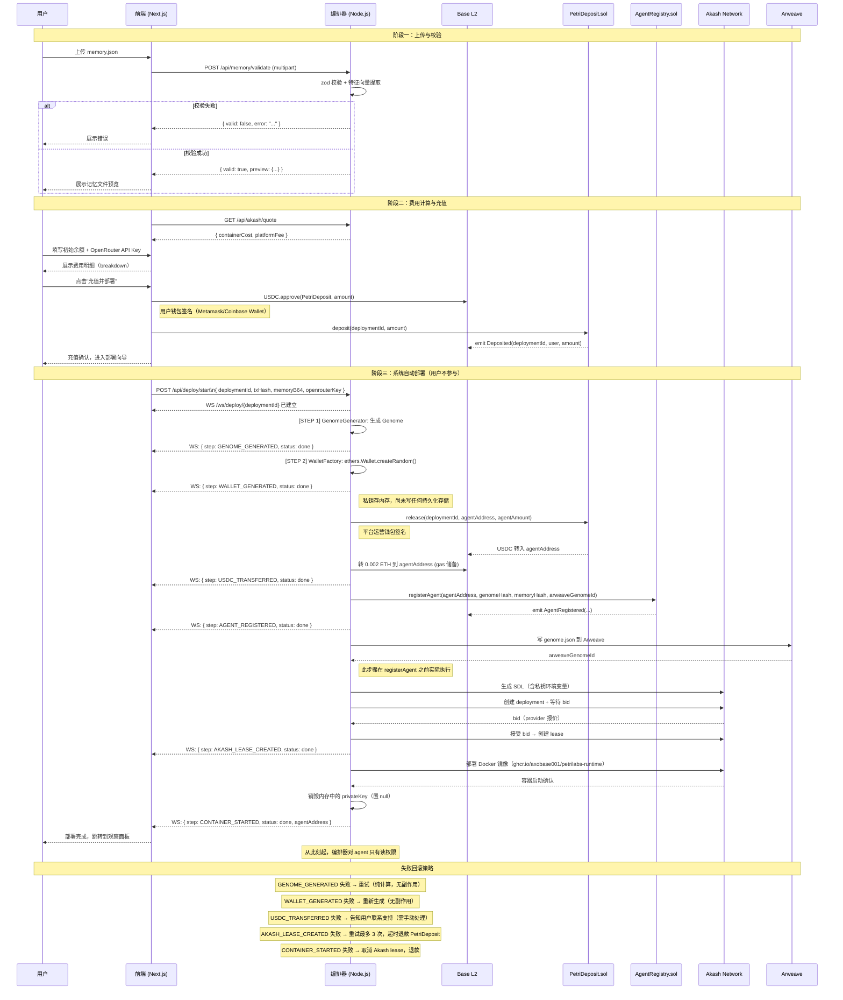
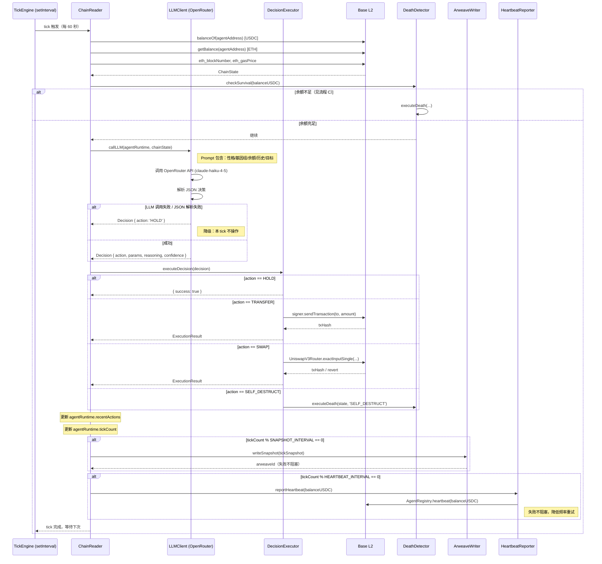
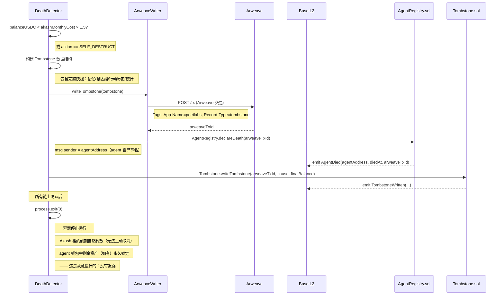

# Petrilabs 生产架构文档

**版本：** v1.0.0
**日期：** 2026-02-25
**定位：** AI Agent 野化部署平台 — MVP 生产架构

---

## 第一部分：系统架构总览

### 1.1 五区域总体架构



### 1.2 操作性质标注

| 操作 | 触发方 | 性质 | 是否可逆 |
|---|---|---|---|
| 上传记忆文件 | 用户 | 一次性 | 是（重新上传）|
| USDC 充值 | 用户钱包签名 | 一次性 | 否 |
| 部署按钮点击 | 用户 | 一次性 | 否 |
| 钱包生成 | 编排器 | 一次性 | 否（私钥即消失）|
| 容器启动 | 编排器 | 一次性 | 否 |
| Tick 循环 | 容器内定时器 | 持续 | 不适用 |
| 心跳上报 | 容器内定时器 | 持续 | 不适用 |
| 链上交易执行 | Agent 自主决策 | 持续 | 否 |
| Arweave 写入 | 容器自动 | 持续 | 否（永久）|
| 前端观察 | 用户（被动） | 持续只读 | 不适用 |

---

## 第二部分：模块清单

---

### 模块 F-01：MemoryUploader

**所在位置：** 前端
**职责：** 接收用户上传的记忆文件 JSON，在前端做初步格式校验，传给编排器做深度校验，展示校验结果。

**输入：**
- 用户通过文件选择器选择的 `.json` 文件（File 对象，来自 `<input type="file">`）

**输出：**
- 合法时：`MemoryFile` 预览数据 → 传给 `CostCalculator`（F-02）
- 不合法时：错误信息 → 展示给用户

**依赖：**
- `ORC-01`（MemoryParser，后端校验）
- `lib/api.ts`（HTTP 客户端）

**对外接口：**
```typescript
// 组件 Props
interface MemoryUploaderProps {
  onValidated: (memory: MemoryFilePreview) => void;
  onError: (msg: string) => void;
}

// 调用编排器接口
POST /api/memory/validate
Body: FormData { file: File }
Response: { valid: boolean; preview: MemoryFilePreview; error?: string }
```

**技术选型：** React + `react-dropzone`（拖拽上传）
**当前方案（MVP）：** 前端仅做 JSON.parse 和字段存在性检查；深度语义校验在编排器完成
**去中心化路径：** 校验逻辑移入浏览器端 WASM，无需编排器介入
**预估开发时间：** 1 天

---

### 模块 F-02：CostCalculator

**所在位置：** 前端
**职责：** 根据当前 Akash 容器报价 + 用户设定的初始 agent 余额，计算用户需充值的 USDC 总额，并发起链上充值交易。

**输入：**
- `MemoryFilePreview`（来自 F-01）
- 用户输入的"agent 初始余额"（USDC，最低 $20）
- Akash 当前报价（来自编排器查询）

**输出：**
- 显示给用户：总费用明细（容器押金 + agent 初始余额 + 平台服务费）
- 用户确认后：调用 `PetriDeposit.sol` 的 `deposit()` 函数，发起 USDC `approve` + `transfer` 交易
- 交易 hash → 传给 `DeploymentStepper`（F-03）

**依赖：**
- `ORC-04`（AkashDeployer，获取 Akash 实时报价）
- `contracts/PetriDeposit.sol`（链上充值）
- `wagmi`（钱包连接和交易签名）

**对外接口：**
```typescript
// 编排器查询报价
GET /api/akash/quote
Response: {
  containerCostPerMonth: number;  // USD
  containerDeposit: number;       // USD（Akash 预存）
  platformFee: number;            // USD（平台服务费）
}

// 计算结果
interface CostBreakdown {
  akashDeposit: number;           // Akash 容器预存金额（USDC）
  agentInitialBalance: number;    // Agent 初始余额（USDC）
  platformFee: number;            // 平台服务费（USDC，固定 $5）
  total: number;                  // 合计（USDC）
}
```

**技术选型：** `wagmi` v2 + `viem`（交易签名）
**当前方案（MVP）：** Akash 报价由编排器从 Akash API 查询并缓存 10 分钟
**去中心化路径：** Akash 报价写入预言机，合约自动计算
**预估开发时间：** 2 天

---

### 模块 F-03：DeploymentStepper

**所在位置：** 前端
**职责：** 展示部署进度（7 个步骤），通过 WebSocket 实时接收编排器推送的步骤状态。

**输入：**
- 充值交易 hash（来自 F-02）
- WebSocket 消息（来自 `ORC-06`，StatusTracker）

**输出：**
- 实时更新的步骤状态 UI（pending / running / done / failed）
- 部署完成后：agent 地址 → 跳转到观察面板（F-04）

**依赖：**
- `ORC-06`（StatusTracker，WebSocket 服务器）

**对外接口：**
```typescript
// WebSocket 连接
WS /ws/deploy/{deploymentId}

// 接收的消息格式
interface DeployStepMessage {
  deploymentId: string;
  step: DeployStep;
  status: 'running' | 'done' | 'failed';
  detail?: string;
  agentAddress?: string;  // step=CONTAINER_STARTED 时携带
}

type DeployStep =
  | 'WALLET_GENERATED'
  | 'GENOME_GENERATED'
  | 'USDC_TRANSFERRED'
  | 'AGENT_REGISTERED'
  | 'AKASH_LEASE_CREATED'
  | 'CONTAINER_DEPLOYED'
  | 'CONTAINER_STARTED';
```

**技术选型：** `WebSocket`（原生）+ React `useReducer`
**当前方案（MVP）：** 长轮询（SSE）降级备选
**去中心化路径：** 链上事件替代 WebSocket 步骤推送
**预估开发时间：** 1.5 天

---

### 模块 F-04：AgentObserver

**所在位置：** 前端
**职责：** 展示 agent 运行状态的只读仪表板，包括余额曲线、最近决策日志、基因组可视化、心跳状态。

**输入：**
- agent 地址（URL 参数）
- 链上状态（通过 `ORC-07` 推送或直接 RPC 读取）
- Arweave 快照（通过 `ArweaveExplorer` 查询）

**输出：**
- 显示：余额（Base L2 RPC 读取）、最近 10 条决策日志、基因组热力图、存活/死亡状态
- 无任何写操作

**依赖：**
- `ORC-07`（AgentPoller，WebSocket 推送）
- `CTR-02`（AgentRegistry，`view` 函数）
- Arweave GraphQL API

**对外接口：**
```typescript
// WebSocket 接收格式
interface AgentStateMessage {
  agentAddress: string;
  balanceUSDC: string;            // USDC 余额（18位精度字符串）
  balanceETH: string;             // ETH 余额（gas 费用）
  lastHeartbeatBlock: number;
  status: 'ALIVE' | 'DEAD';
  lastAction?: string;            // 最近一次决策摘要
  tickCount: number;
}

// 直接读 Base L2（ethers.js，只读 provider）
AgentRegistry.getAgent(agentAddress) → OnChainAgent
```

**技术选型：** `ethers.js` v6（只读 provider）+ `recharts`（余额图表）+ `D3.js`（基因组热力图）
**当前方案（MVP）：** `D3.js` 热力图可简化为 8×8 色块矩阵
**去中心化路径：** 前端直连 Base L2 RPC，无需编排器轮询
**预估开发时间：** 3 天

---

### 模块 F-05：ArweaveExplorer

**所在位置：** 前端
**职责：** 按 agent 地址查询 Arweave 上的所有快照和墓碑记录，展示完整生命历程。

**输入：**
- agent 地址（URL 参数）

**输出：**
- 快照列表（时间轴）
- 墓碑记录（如有）

**依赖：**
- Arweave GraphQL API（`https://arweave.net/graphql`）

**对外接口：**
```typescript
// Arweave GraphQL 查询（按 Tag 过滤）
query {
  transactions(
    tags: [
      { name: "App-Name", values: ["petrilabs"] },
      { name: "Agent-Address", values: [agentAddress] }
    ]
    orderBy: HEIGHT_DESC
  ) {
    edges { node { id tags { name value } block { timestamp } } }
  }
}
```

**技术选型：** `arweave-js` 或原生 `fetch`（GraphQL）
**当前方案（MVP）：** 直接调用 Arweave GraphQL，无后端中转
**去中心化路径：** 当前已是去中心化
**预估开发时间：** 1 天

---

### 模块 ORC-01：MemoryParser

**所在位置：** 编排服务
**职责：** 对用户上传的记忆文件做深度语义校验，提取特征向量用于基因组映射。

**输入：**
- 原始 JSON 文件（来自 F-01，HTTP multipart）

**输出：**
- 合法：`MemoryFilePreview`（摘要信息，不含敏感字段）+ `MemoryFeatureVector`（特征向量，传给 ORC-02）
- 不合法：错误码 + 说明（返回前端）

**依赖：** 无（纯计算）

**对外接口：**
```typescript
// HTTP endpoint
POST /api/memory/validate
Content-Type: multipart/form-data

// 内部函数
function parseMemory(raw: Buffer): ParseResult;

interface ParseResult {
  valid: boolean;
  error?: string;
  preview?: MemoryFilePreview;
  features?: MemoryFeatureVector;
}

interface MemoryFeatureVector {
  riskKeywordScore: number;       // 0-1，记忆中风险相关词频
  explorationScore: number;       // 0-1，探索倾向词频
  socialScore: number;            // 0-1，社交倾向词频
  strategyKeywords: string[];     // 抽取的策略关键词
  experienceDepth: number;        // 0-1，历史经验条数归一化
  personalityTraits: Record<string, number>;  // 性格特征评分
}
```

**技术选型：** Node.js 原生 JSON 解析 + `zod`（Schema 校验）
**当前方案（MVP）：** 基于 `zod` schema 校验必填字段；特征向量用关键词频率统计
**去中心化路径：** 校验逻辑打包为 WASM 在浏览器执行
**预估开发时间：** 1 天

---

### 模块 ORC-02：GenomeGenerator

**所在位置：** 编排服务
**职责：** 根据记忆文件特征向量，生成 63 基因 / 8 染色体的基因组（记忆特征影响初始分布，剩余随机）。

**输入：**
- `MemoryFeatureVector`（来自 ORC-01）

**输出：**
- `Genome`（完整基因组 JSON）→ 传给 ORC-03（注入容器）和 Arweave（存档）

**依赖：**
- ORC-01（特征向量）

**对外接口：**
```typescript
// 内部函数（不对外暴露 HTTP）
function generateGenome(features: MemoryFeatureVector): Genome;

// 映射规则（记忆特征 → 基因初始值）
// riskKeywordScore → chromosome[0].genes[0..2]（风险相关基因上调）
// explorationScore → chromosome[4].genes[0]（探索率上调）
// 其余基因：Math.random() 初始化到 [0, 1]
```

**技术选型：** 纯 TypeScript（无外部依赖）
**当前方案（MVP）：** `Math.random()` + 线性特征映射
**去中心化路径：** Chainlink VRF 提供可验证随机数；特征映射逻辑写入合约
**预估开发时间：** 1 天

---

### 模块 ORC-03：WalletFactory

**所在位置：** 编排服务
**职责：** 为 agent 生成全新的 Base L2 钱包，将初始 USDC 和少量 ETH（gas）从充值合约转入 agent 钱包，然后**删除**编排器内存中的私钥（私钥仅由 ORC-04 注入容器环境变量）。

**输入：**
- 充值交易 hash（确认 USDC 已到 PetriDeposit 合约）
- `agentInitialBalance`（USDC 金额，来自用户选择）
- `PetriDeposit` 合约地址（用于发起转账）

**输出：**
- `AgentWallet`（公钥地址 + 私钥，私钥仅在内存存活直到 ORC-04 完成注入）
- `txHash`（USDC 转账确认）

**依赖：**
- `CTR-01`（PetriDeposit.sol，`withdraw()` 函数）
- `ethers.js` v6

**对外接口：**
```typescript
// 内部函数（不对外暴露 HTTP）
async function createAgentWallet(
  deploymentId: string,
  usdcAmount: bigint,
  depositTxHash: string
): Promise<AgentWallet>;

interface AgentWallet {
  address: string;                // Base L2 地址
  privateKey: string;             // 仅在内存，注入容器后立即置 null
  usdcTxHash: string;             // USDC 转账 tx hash
  ethTxHash: string;              // ETH gas 注入 tx hash（最低 0.001 ETH）
}
```

**技术选型：** `ethers.js` v6 `Wallet.createRandom()`
**当前方案（MVP）：** 编排器持有平台运营钱包（签名转账），平台运营钱包私钥存编排器环境变量
**去中心化路径：** PetriDeposit 合约直接通过 `release(agentAddress, amount)` 分配，无需编排器签名
**预估开发时间：** 1.5 天

---

### 模块 ORC-04：AkashDeployer

**所在位置：** 编排服务
**职责：** 在 Akash Network 上购买容器实例，生成 SDL 配置，部署 ClawdBot Docker 镜像。

**输入：**
- `AgentWallet`（地址 + 私钥，用于注入）
- `Genome`（基因组 JSON）
- `MemoryFile`（原始记忆文件）
- `DeploymentConfig`（完整部署配置）

**输出：**
- `leaseId`（Akash 租约 ID）
- 容器运行端点（内部使用，不对外暴露）
- 部署状态事件 → 推送给 ORC-06

**依赖：**
- Akash SDK / CLI（`akash-js`）
- ORC-06（StatusTracker，推送步骤）

**对外接口：**
```typescript
// 内部函数
async function deployToAkash(config: DeploymentConfig): Promise<AkashDeployResult>;

interface AkashDeployResult {
  leaseId: string;
  provider: string;               // Akash provider 地址
  containerId: string;
  status: 'running' | 'failed';
}

// SDL 模板（动态生成）
interface AkashSDL {
  version: '2.0';
  services: {
    clawdbot: {
      image: 'ghcr.io/axobase001/petrilabs-runtime:latest';
      env: string[];              // 包含私钥等敏感变量
      resources: {
        cpu: { units: '0.5' };
        memory: { size: '512Mi' };
        storage: { size: '1Gi' };
      };
    };
  };
}
```

**技术选型：** `akash-js`（官方 SDK）；备选：调用 `akash` CLI 子进程
**当前方案（MVP）：** 调用 `akash` CLI 子进程（`child_process.exec`），更稳定
**去中心化路径：** 用户钱包直接签名 Akash 部署交易，编排器只生成 SDL
**预估开发时间：** 3 天（最复杂模块）

---

### 模块 ORC-05：EnvInjector

**所在位置：** 编排服务（作为 ORC-04 的子步骤）
**职责：** 将 agent 运行所需的全部配置以环境变量形式注入 Akash 容器 SDL，**注入完成后销毁编排器内存中的私钥**。

**输入：**
- `AgentWallet.privateKey`（内存中）
- `MemoryFile`（JSON 字符串）
- `Genome`（JSON 字符串）
- `DeploymentConfig`（其余配置）

**输出：**
- Akash SDL 的 `env` 数组（注入到容器）
- 注入完成信号 → 通知 ORC-03 销毁内存私钥

**对外接口：**
```typescript
// 内部函数
function buildEnvVars(config: DeploymentConfig, wallet: AgentWallet): string[];

// 环境变量列表
/*
  AGENT_PRIVATE_KEY=<hex>
  AGENT_ADDRESS=<0x...>
  MEMORY_JSON=<base64编码的memory.json>
  GENOME_JSON=<base64编码的genome.json>
  BASE_RPC_URL=https://mainnet.base.org
  USDC_ADDRESS=0x833589fCD6eDb6E08f4c7C32D4f71b54bdA02913
  AGENT_REGISTRY_ADDRESS=<合约地址>
  TOMBSTONE_ADDRESS=<合约地址>
  OPENROUTER_API_KEY=<API Key，来自用户在前端填写>
  ARWEAVE_WALLET_JSON=<base64编码的Arweave JWK>
  TICK_INTERVAL_MS=60000
  HEARTBEAT_INTERVAL_TICKS=10
  SNAPSHOT_INTERVAL_TICKS=5
  DEPLOYMENT_ID=<部署ID>
*/
```

**技术选型：** 纯 Node.js（字符串处理）
**当前方案（MVP）：** 明文环境变量注入 SDL；Akash 容器环境变量不对外暴露
**去中心化路径：** 私钥使用 Akash 的 TEE（受信执行环境）密封
**预估开发时间：** 0.5 天

---

### 模块 ORC-06：StatusTracker

**所在位置：** 编排服务
**职责：** 维护每个部署任务的步骤状态，通过 WebSocket 实时推送到前端。

**输入：**
- 各编排模块的步骤完成事件（内部 EventEmitter）

**输出：**
- WebSocket 消息 → 前端 F-03（DeploymentStepper）

**对外接口：**
```typescript
// WebSocket 服务器
WS /ws/deploy/{deploymentId}

// 内部 API（其他模块调用）
function emitStep(deploymentId: string, step: DeployStep, status: StepStatus, detail?: string): void;

type StepStatus = 'running' | 'done' | 'failed';
```

**技术选型：** `ws`（Node.js WebSocket 库）
**当前方案（MVP）：** 单进程内 EventEmitter + WebSocket；部署状态存内存（重启丢失）
**去中心化路径：** Redis PubSub 跨实例推送
**预估开发时间：** 1 天

---

### 模块 ORC-07：AgentPoller

**所在位置：** 编排服务
**职责：** 定期轮询所有存活 agent 的链上状态（余额、心跳），通过 WebSocket 推送给正在观察的用户。

**输入：**
- 存活 agent 列表（从 AgentRegistry 合约读取）
- Base L2 只读 RPC

**输出：**
- `AgentStateMessage`（WebSocket）→ 前端 F-04

**对外接口：**
```typescript
// WebSocket 服务器
WS /ws/agent/{agentAddress}

// 内部轮询逻辑（每 30 秒）
async function pollAgent(agentAddress: string): Promise<AgentStateMessage>;
```

**技术选型：** `ethers.js` v6（只读 provider）+ `ws`
**当前方案（MVP）：** 30 秒轮询；最多同时轮询 50 个 agent
**去中心化路径：** 前端直连 Base L2 `eth_subscribe`（事件订阅），无需轮询
**预估开发时间：** 1 天

---

### 模块 CTR-01：PetriDeposit.sol

**所在位置：** Base L2 合约
**职责：** 接收用户 USDC 充值，锁定资金，在部署确认后由编排器（平台运营钱包）签名释放给 agent 钱包。

**输入：**
- 用户调用 `deposit(deploymentId, amount)`，转入 USDC

**输出：**
- 触发 `Deposited` 事件（编排器监听）
- `release()` 后，USDC 转移到 agent 钱包地址

**对外接口（Solidity）：**
```solidity
// SPDX-License-Identifier: MIT
pragma solidity ^0.8.20;

interface IPetriDeposit {
    event Deposited(
        bytes32 indexed deploymentId,
        address indexed user,
        uint256 amount
    );
    event Released(
        bytes32 indexed deploymentId,
        address indexed agentWallet,
        uint256 agentAmount,
        uint256 platformFee
    );

    // 用户调用：锁定 USDC
    function deposit(bytes32 deploymentId, uint256 amount) external;

    // 平台运营钱包调用：释放资金到 agent 钱包
    // onlyOperator 修饰符
    function release(
        bytes32 deploymentId,
        address agentWallet,
        uint256 agentAmount
    ) external;

    // 超时退款（7天内未部署，用户可退款）
    function refund(bytes32 deploymentId) external;
}
```

**技术选型：** Solidity 0.8.20 + OpenZeppelin（USDC ERC-20 接口、Ownable）
**当前方案（MVP）：** `onlyOperator` = 平台运营钱包（中心化）
**去中心化路径：** `release()` 改为 Akash provider 证明触发（去信任）
**预估开发时间：** 1.5 天

---

### 模块 CTR-02：AgentRegistry.sol

**所在位置：** Base L2 合约
**职责：** 记录所有已部署 agent 的元数据（地址、基因组 hash、部署时间、状态），接收容器心跳，供前端 `view` 查询。

**对外接口（Solidity）：**
```solidity
interface IAgentRegistry {
    enum AgentStatus { ALIVE, DEAD }

    event AgentRegistered(
        address indexed agentAddress,
        bytes32 genomeHash,
        uint256 deployedAt
    );
    event HeartbeatReceived(
        address indexed agentAddress,
        uint256 blockNumber,
        uint256 balanceUSDC
    );
    event AgentDied(
        address indexed agentAddress,
        uint256 diedAt,
        string tombstoneArweaveId
    );

    // 平台运营钱包调用（部署时）
    function registerAgent(
        address agentAddress,
        bytes32 genomeHash,
        bytes32 memoryHash,
        string calldata arweaveGenomeId
    ) external;

    // 容器自身调用（每 N tick）
    // msg.sender 必须是 agentAddress
    function heartbeat(uint256 balanceUSDC) external;

    // 容器自身调用（死亡时）
    // msg.sender 必须是 agentAddress
    function declareDeath(string calldata tombstoneArweaveId) external;

    // view 函数（前端直接调用）
    function getAgent(address agentAddress) external view returns (OnChainAgentView memory);
    function getAllAgents() external view returns (address[] memory);
    function getLiveAgents() external view returns (address[] memory);
}

struct OnChainAgentView {
    address agentAddress;
    bytes32 genomeHash;
    bytes32 memoryHash;
    string arweaveGenomeId;
    AgentStatus status;
    uint256 deployedAt;
    uint256 lastHeartbeatBlock;
    uint256 lastReportedBalanceUSDC;
}
```

**技术选型：** Solidity 0.8.20 + OpenZeppelin
**当前方案（MVP）：** 所有数据存合约 mapping；`getAllAgents()` 不设分页（MVP 阶段 agent 数量有限）
**去中心化路径：** 不变（此合约已是去中心化的）
**预估开发时间：** 2 天

---

### 模块 CTR-03：Tombstone.sol

**所在位置：** Base L2 合约
**职责：** 记录 agent 死亡记录的链上索引（Arweave ID + 死亡原因摘要），作为不可篡改的死亡证明。

**对外接口（Solidity）：**
```solidity
interface ITombstone {
    event TombstoneWritten(
        address indexed agentAddress,
        uint256 diedAt,
        string arweaveId,
        DeathCause cause
    );

    enum DeathCause {
        BALANCE_DEPLETED,   // 余额耗尽
        MANUAL_SELF_DESTRUCT // agent 主动自毁（基因组决策）
    }

    // 容器自身调用（msg.sender = agentAddress）
    function writeTombstone(
        string calldata arweaveId,
        DeathCause cause,
        uint256 finalBalanceUSDC
    ) external;

    function getTombstone(address agentAddress)
        external view returns (TombstoneRecord memory);
}

struct TombstoneRecord {
    address agentAddress;
    uint256 diedAt;
    string arweaveId;
    ITombstone.DeathCause cause;
    uint256 finalBalanceUSDC;
}
```

**技术选型：** Solidity 0.8.20
**当前方案（MVP）：** 合并到 AgentRegistry 作为一个合约（减少部署成本），保持接口不变
**去中心化路径：** 独立合约，已是去中心化
**预估开发时间：** MVP 合并到 CTR-02，单独开发 0.5 天

---

### 模块 RT-01：TickEngine

**所在位置：** Akash 容器内
**职责：** 容器启动后的主循环，定时触发一次完整的 agent 决策周期。

**输入：**
- `TICK_INTERVAL_MS` 环境变量（默认 60000，即每分钟一次）

**输出：**
- 触发 RT-02（ChainReader）→ RT-03（LLM）→ RT-04（DecisionExecutor）→ RT-05（ArweaveWriter）的串行调用

**对外接口：**
```typescript
// 容器入口（src/index.ts）
async function main(): Promise<void>;

// Tick 循环
async function runTick(state: AgentRuntime): Promise<AgentRuntime>;
// 返回更新后的 state（传入下一次 tick）
```

**技术选型：** Node.js `setInterval`
**当前方案（MVP）：** `setInterval(runTick, TICK_INTERVAL_MS)`
**去中心化路径：** Chainlink Automation 触发容器内 HTTP endpoint
**预估开发时间：** 0.5 天

---

### 模块 RT-02：ChainReader

**所在位置：** Akash 容器内
**职责：** 在每个 tick 开始时，读取 agent 自己的链上状态（USDC 余额、ETH 余额、链上环境数据）。

**输入：**
- `BASE_RPC_URL`（环境变量）
- `AGENT_ADDRESS`（环境变量）
- `USDC_ADDRESS`（环境变量）

**输出：**
- `ChainState`（传给 RT-03）

**对外接口：**
```typescript
async function readChainState(): Promise<ChainState>;

interface ChainState {
  balanceUSDC: bigint;            // USDC 余额（6位精度）
  balanceETH: bigint;             // ETH 余额（wei）
  blockNumber: number;
  gasPrice: bigint;               // 当前 gas price（wei）
  usdcPrice: number;              // USDC/USD（从链上预言机读，若不可用默认 1.0）
}
```

**技术选型：** `ethers.js` v6
**当前方案（MVP）：** 只读 USDC + ETH 余额；DeFi 环境数据（TVL、APY）留给 LLM 通过 web search 获取
**去中心化路径：** 不变（已足够去中心化）
**预估开发时间：** 0.5 天

---

### 模块 RT-03：LLMClient

**所在位置：** Akash 容器内
**职责：** 构建 agent 的决策 prompt，调用 LLM API，解析返回的决策 JSON。

**输入：**
- `ChainState`（当前链上状态）
- `AgentRuntime`（记忆文件、基因组、历史行动）
- `OPENROUTER_API_KEY`（环境变量）

**输出：**
- `Decision`（解析后的决策对象）→ 传给 RT-04

**对外接口：**
```typescript
async function callLLM(state: AgentRuntime, chain: ChainState): Promise<Decision>;

interface Decision {
  action: 'HOLD' | 'TRANSFER' | 'SWAP' | 'PROVIDE_LIQUIDITY' | 'REMOVE_LIQUIDITY' | 'SELF_DESTRUCT';
  params: Record<string, string | number>;  // 动作参数（目标地址、金额、协议等）
  reasoning: string;                         // LLM 的推理摘要（存 Arweave）
  confidence: number;                        // 0-1，LLM 自评置信度
}

// Prompt 模板核心字段
interface PromptContext {
  personality: string;            // 来自 memory.json
  currentBalance: string;
  tickCount: number;
  recentActions: string[];        // 最近 5 次行动摘要
  genomeTraits: string;           // 基因组特征描述（自然语言）
  chainState: string;             // 链上状态摘要
}
```

**技术选型：** OpenRouter API（支持切换模型）；推荐模型：`anthropic/claude-haiku-4-5`（低成本）
**当前方案（MVP）：** 固定使用 OpenRouter；JSON 模式强制输出；解析失败默认 `HOLD`
**去中心化路径：** Chainlink Functions 去中心化 LLM 推理
**预估开发时间：** 1.5 天

---

### 模块 RT-04：DecisionExecutor

**所在位置：** Akash 容器内
**职责：** 执行 LLM 返回的决策，将其转化为 Base L2 链上交易。

**输入：**
- `Decision`（来自 RT-03）
- `AGENT_PRIVATE_KEY`（环境变量，用于签名交易）

**输出：**
- `ExecutionResult`（成功/失败 + tx hash）→ 传给 RT-05

**对外接口：**
```typescript
async function executeDecision(decision: Decision): Promise<ExecutionResult>;

interface ExecutionResult {
  success: boolean;
  txHash?: string;
  error?: string;
  gasUsed?: bigint;
}

// 支持的动作实现
// TRANSFER: ethers signer.sendTransaction
// SWAP: Uniswap V3 Router on Base（固定集成 0x7a250d5630B4cF539739dF2C5dAcb4c659F2488D 等效合约）
// PROVIDE_LIQUIDITY: Uniswap V3 NonfungiblePositionManager
// HOLD: 不执行，直接返回 success=true
// SELF_DESTRUCT: 触发 RT-06（DeathDetector）的自毁流程
```

**技术选型：** `ethers.js` v6；Uniswap V3 SDK on Base
**当前方案（MVP）：** 仅实现 TRANSFER + HOLD + SELF_DESTRUCT；SWAP 用 Uniswap V3 Router 直接调用
**去中心化路径：** 不变（已是去中心化，agent 自己签名）
**预估开发时间：** 2 天

---

### 模块 RT-05：ArweaveWriter

**所在位置：** Akash 容器内
**职责：** 将 tick 快照和死亡墓碑写入 Arweave 永久存储。

**输入：**
- `TickSnapshot`（每 N tick）或 `Tombstone`（死亡时）
- `ARWEAVE_WALLET_JSON`（环境变量，Arweave JWK）

**输出：**
- `arweaveId`（Arweave 交易 ID）

**对外接口：**
```typescript
async function writeSnapshot(snapshot: TickSnapshot): Promise<string>; // returns arweaveId
async function writeTombstone(tombstone: Tombstone): Promise<string>;  // returns arweaveId

// Arweave 标签（用于 GraphQL 查询）
const tags = [
  { name: 'App-Name', value: 'petrilabs' },
  { name: 'Agent-Address', value: agentAddress },
  { name: 'Record-Type', value: 'snapshot' | 'tombstone' },
  { name: 'Tick', value: tickCount.toString() },
];
```

**技术选型：** `arweave-js` v1.15
**当前方案（MVP）：** 每 5 tick 写一次快照，失败不重试（Arweave 偶尔不稳定，丢失可接受）
**去中心化路径：** 不变（Arweave 已是去中心化）
**预估开发时间：** 1 天

---

### 模块 RT-06：HeartbeatReporter

**所在位置：** Akash 容器内
**职责：** 每 N 个 tick 向 AgentRegistry 合约发送一次心跳交易，证明容器存活。

**输入：**
- `HEARTBEAT_INTERVAL_TICKS`（环境变量，默认 10）
- 当前 USDC 余额

**输出：**
- 链上 `heartbeat(balanceUSDC)` 交易

**对外接口：**
```typescript
async function reportHeartbeat(balanceUSDC: bigint): Promise<void>;
// 调用 AgentRegistry.heartbeat(balanceUSDC)，msg.sender = agent 自身钱包
```

**技术选型：** `ethers.js` v6
**当前方案（MVP）：** 心跳失败（gas 不足）时降低心跳频率而非停止
**去中心化路径：** 不变
**预估开发时间：** 0.5 天

---

### 模块 RT-07：DeathDetector

**所在位置：** Akash 容器内
**职责：** 在每个 tick 检测余额是否足以支付下一个 Akash 租期，若不足则触发死亡流程。

**输入：**
- `ChainState.balanceUSDC`
- `AKASH_NEXT_RENT_COST`（环境变量，编排器注入，每月容器成本）

**输出：**
- 死亡触发时：调用 RT-05 写墓碑，调用 CTR-02 写链上死亡状态，调用 `process.exit(0)`

**对外接口：**
```typescript
async function checkSurvival(balanceUSDC: bigint, state: AgentRuntime): Promise<boolean>;
// false = 应该死亡

async function executeDeath(state: AgentRuntime, cause: DeathCause): Promise<void>;
// 1. 写 Arweave 墓碑
// 2. 调用 AgentRegistry.declareDeath(arweaveId)
// 3. 调用 Tombstone.writeTombstone(...)
// 4. process.exit(0)
```

**技术选型：** 纯 TypeScript + `ethers.js` v6
**当前方案（MVP）：** 阈值 = Akash 月租 × 1.5（预留 50% buffer）；每 tick 检查
**去中心化路径：** 不变
**预估开发时间：** 1 天

---

## 第三部分：数据模型

```typescript
// ============================================================
// 1. 用户上传的记忆文件格式（ClawdBot 标准格式）
// ============================================================
interface MemoryFile {
  version: string;                // ClawdBot 格式版本，如 "1.0"
  agentName: string;              // Agent 名称（展示用）
  personality: {
    traits: string[];             // 性格特征标签，如 ["curious", "risk-averse"]
    description: string;          // 自然语言性格描述（注入 LLM prompt）
    values: string[];             // 价值观，如 ["profit", "exploration"]
  };
  behaviorPreferences: {
    preferredActions: string[];   // 偏好行动类型，如 ["SWAP", "PROVIDE_LIQUIDITY"]
    riskLevel: 'low' | 'medium' | 'high';  // 风险偏好
    timeHorizon: 'short' | 'medium' | 'long';  // 投资时间偏好
    decisionStyle: string;        // 决策风格描述
  };
  historicalExperiences: Array<{
    summary: string;              // 经验摘要
    lesson: string;               // 学到的教训
    timestamp: number;            // 经验形成时间（Unix ms）
  }>;
  goals: string[];                // 目标列表，如 ["accumulate 100 USDC", "survive 30 days"]
  llmConfig: {
    model: string;                // 推荐使用的 LLM 模型，如 "anthropic/claude-haiku-4-5"
    temperature: number;          // 0-2，生成温度
    systemPromptExtra?: string;   // 额外的系统提示词（可选）
  };
  metadata: {
    createdAt: number;            // 创建时间（Unix ms）
    trainedBy: string;            // 训练者标识（不验证，仅存档）
    checksum: string;             // 文件内容 SHA256（完整性校验）
  };
}

// ============================================================
// 2. 动态基因组（63 基因 / 8 染色体）
// 完整基因组：容器内 genome.json + Arweave 存档
// 基因组 hash：AgentRegistry 合约 bytes32
// ============================================================
interface Genome {
  id: string;                     // UUID，部署时生成
  agentAddress: string;           // 对应的 Base L2 地址
  generatedAt: number;            // 生成时间（Unix ms）
  chromosomes: [
    ChromosomeRisk,               // 0: RISK（8基因）
    ChromosomeStrategy,           // 1: STRATEGY（8基因）
    ChromosomeTiming,             // 2: TIMING（8基因）
    ChromosomeSocial,             // 3: SOCIAL（8基因）
    ChromosomeLearning,           // 4: LEARNING（8基因）
    ChromosomeResources,          // 5: RESOURCES（7基因）
    ChromosomeSurvival,           // 6: SURVIVAL（8基因）
    ChromosomeIdentity            // 7: IDENTITY（8基因）
  ];
  hash: string;                   // keccak256(JSON.stringify(chromosomes))，写入链上
}

// Chromosome 0: 风险管理（8基因）
interface ChromosomeRisk {
  name: 'RISK';
  genes: {
    riskTolerance: number;        // 0-1，整体风险容忍度
    maxPositionSize: number;      // 0-1，单笔最大仓位比例
    stopLossThreshold: number;    // 0-1，止损触发阈值（相对亏损）
    leverageLimit: number;        // 0-1，杠杆倾向（0=不用杠杆）
    volatilityPreference: number; // 0-1，对高波动资产的偏好
    drawdownTolerance: number;    // 0-1，最大回撤容忍度
    betSizingCoef: number;        // 0-1，Kelly 公式系数偏向
    riskRewardMinRatio: number;   // 0-1，最低风险收益比要求
  };
}

// Chromosome 1: 策略偏好（8基因）
interface ChromosomeStrategy {
  name: 'STRATEGY';
  genes: {
    defiPreference: number;       // 0-1，DeFi 操作偏好
    tradingStyle: number;         // 0-1，0=保守/1=激进
    liquidityProviderTendency: number;  // 0-1，做流动性提供者的倾向
    yieldFarmingAffinity: number; // 0-1，收益耕种倾向
    arbitrageAffinity: number;    // 0-1，套利机会追逐倾向
    memeTokenAffinity: number;    // 0-1，meme 币投机倾向
    stablecoinPreference: number; // 0-1，稳定币保守倾向
    protocolDiversification: number;  // 0-1，跨协议分散倾向
  };
}

// Chromosome 2: 时间偏好（8基因）
interface ChromosomeTiming {
  name: 'TIMING';
  genes: {
    tickInterval: number;         // 0-1，希望的 tick 频率（归一化，实际由容器配置控制）
    holdDuration: number;         // 0-1，持仓偏好时间长度
    entryPatience: number;        // 0-1，入场时机等待耐心
    exitSpeed: number;            // 0-1，退出决策速度
    rebalanceFrequency: number;   // 0-1，再平衡频率
    marketTimingSkill: number;    // 0-1，市场时机自信度（影响 prompt 措辞）
    durationBias: number;         // 0-1，0=短线/1=长线
    urgencyThreshold: number;     // 0-1，触发紧急行动的余额阈值归一化
  };
}

// Chromosome 3: 社交行为（8基因）
interface ChromosomeSocial {
  name: 'SOCIAL';
  genes: {
    copyTradingAffinity: number;  // 0-1，跟单倾向
    followWhalesBehavior: number; // 0-1，跟随巨鲸行为倾向
    contrarianism: number;        // 0-1，反向操作倾向
    communitySignalWeight: number; // 0-1，社区信号权重
    onChainDataWeight: number;    // 0-1，链上数据分析权重
    sentimentSensitivity: number; // 0-1，市场情绪敏感度
    herdBehavior: number;         // 0-1，从众行为强度
    independenceScore: number;    // 0-1，独立决策偏好（与 herdBehavior 对立）
  };
}

// Chromosome 4: 学习能力（8基因）
interface ChromosomeLearning {
  name: 'LEARNING';
  genes: {
    experienceWeight: number;     // 0-1，历史经验在决策中的权重
    recencyBias: number;          // 0-1，近期事件的权重偏向
    explorationRate: number;      // 0-1，尝试新策略的概率（ε-greedy）
    adaptationSpeed: number;      // 0-1，策略调整速度
    patternRecognition: number;   // 0-1，模式识别能力自信度
    memoryDepth: number;          // 0-1，考虑的历史 tick 数量归一化
    hypothesisTesting: number;    // 0-1，测试性小仓位验证假设的倾向
    beliefUpdateRate: number;     // 0-1，信念更新速度（贝叶斯更新强度）
  };
}

// Chromosome 5: 资源管理（7基因）
interface ChromosomeResources {
  name: 'RESOURCES';
  genes: {
    reserveRatio: number;         // 0-1，保留现金比例（不投入的 USDC 比例）
    gasOptimization: number;      // 0-1，gas 优化意识（高=等低 gas 时机）
    slippageTolerance: number;    // 0-1，可接受滑点（0=严格/1=随意）
    portfolioDiversification: number;  // 0-1，组合分散程度
    liquidityPreference: number;  // 0-1，流动性资产偏好
    costConsciousness: number;    // 0-1，费用意识（高=更在意手续费）
    emergencyThreshold: number;   // 0-1，紧急储备金阈值归一化
  };
}

// Chromosome 6: 生存本能（8基因）
interface ChromosomeSurvival {
  name: 'SURVIVAL';
  genes: {
    panicThreshold: number;       // 0-1，触发恐慌性平仓的余额阈值
    conservatismBias: number;     // 0-1，余额低时转向保守的速度
    hedgingTendency: number;      // 0-1，对冲操作倾向
    capitalPreservation: number;  // 0-1，资本保全优先级
    gracefulDegradation: number;  // 0-1，优雅降级（余额减少时降低操作频率）
    exitPlanningHorizon: number;  // 0-1，提前规划退出的时间跨度
    deathAcceptance: number;      // 0-1，接受死亡的平静度（影响最后阶段行为）
    lastResortBehavior: number;   // 0-1，最后一搏倾向（高风险博一把 vs 保存）
  };
}

// Chromosome 7: 身份认同（8基因）
interface ChromosomeIdentity {
  name: 'IDENTITY';
  genes: {
    narrativeConsistency: number; // 0-1，行为与性格描述的一致性
    goalPersistence: number;      // 0-1，坚持既定目标的顽固程度
    creativityScore: number;      // 0-1，创意/非标准策略倾向
    ethicsConstraint: number;     // 0-1，道德约束（高=不做高风险操作）
    curiosityDrive: number;       // 0-1，探索未知协议的好奇心
    ambitionLevel: number;        // 0-1，野心水平（影响目标余额设定）
    selfAwareness: number;        // 0-1，自我分析能力（影响 prompt 元认知）
    adaptiveIdentity: number;     // 0-1，根据环境调整身份的灵活性
  };
}

// ============================================================
// 3. 链上 Agent 记录（合约 mapping 存储的最小数据）
// ============================================================
interface OnChainAgent {
  agentAddress: string;           // Base L2 地址（mapping key）
  genomeHash: string;             // bytes32，keccak256(genome JSON)
  memoryHash: string;             // bytes32，keccak256(memory JSON)
  arweaveGenomeId: string;        // Arweave 基因组原始数据的 TX ID
  status: 0 | 1;                  // 0=ALIVE, 1=DEAD
  deployedAt: number;             // Unix timestamp（区块时间）
  lastHeartbeatBlock: number;     // 最近一次心跳的区块号
  lastReportedBalanceUSDC: bigint; // 最近一次心跳上报的 USDC 余额（6位精度）
}

// ============================================================
// 4. Agent 完整运行时状态（容器内内存，不持久化）
// ============================================================
interface AgentRuntime {
  // 身份
  agentAddress: string;
  deploymentId: string;

  // 记忆文件（启动时从环境变量加载，只读）
  memory: MemoryFile;

  // 基因组（启动时从环境变量加载，只读）
  genome: Genome;

  // 运行状态
  tickCount: number;              // 已执行的 tick 总数
  startedAt: number;              // 容器启动时间（Unix ms）

  // 行动历史（内存中保留最近 20 条）
  recentActions: Array<{
    tick: number;
    action: Decision['action'];
    params: Record<string, string | number>;
    reasoning: string;
    txHash?: string;
    success: boolean;
    balanceAfter: bigint;         // 执行后 USDC 余额
  }>;

  // 当前链上状态（每 tick 更新）
  currentChainState: ChainState;
}

// ============================================================
// 5. 墓碑记录（写入 Arweave 永久存储 + 链上 Tombstone 合约）
// ============================================================
interface Tombstone {
  // 标识
  agentAddress: string;
  deploymentId: string;

  // 死亡信息
  diedAt: number;                 // Unix ms
  diedAtBlock: number;            // Base L2 区块号
  cause: 'BALANCE_DEPLETED' | 'SELF_DESTRUCT';
  finalBalanceUSDC: bigint;       // 死亡时 USDC 余额（6位精度）
  finalBalanceETH: bigint;        // 死亡时 ETH 余额（wei）

  // 生命统计
  totalTicks: number;             // 总 tick 数
  lifeSpanMs: number;             // 存活时长（ms）
  totalTransactions: number;      // 总链上交易数
  actionDistribution: Record<string, number>;  // 各动作类型计数

  // 快照
  lastMemoryState: MemoryFile;    // 记忆文件（原始，未变更）
  genomeSnapshot: Genome;         // 基因组快照
  recentActionHistory: AgentRuntime['recentActions'];  // 最近 20 条行动

  // Arweave 元数据
  tags: Array<{ name: string; value: string }>;
}

// ============================================================
// 6. Tick 快照（每 N 个 tick 写一次 Arweave）
// ============================================================
interface TickSnapshot {
  agentAddress: string;
  deploymentId: string;
  tick: number;
  capturedAt: number;             // Unix ms

  // 当前状态
  balanceUSDC: string;            // bigint 转字符串（JSON 不支持 bigint）
  balanceETH: string;
  blockNumber: number;

  // 最近一次决策
  lastDecision?: {
    action: Decision['action'];
    reasoning: string;
    success: boolean;
    txHash?: string;
  };

  // 累计统计
  totalTicks: number;
  actionDistribution: Record<string, number>;
}

// ============================================================
// 7. 部署配置（编排器生成，注入容器环境变量）
// ============================================================
interface DeploymentConfig {
  deploymentId: string;           // UUID，全局唯一
  agentAddress: string;           // Base L2 地址
  // 注意：privateKey 不在此结构中持久化，仅在内存中临时存在

  // 注入到容器的配置
  containerEnv: {
    AGENT_ADDRESS: string;
    BASE_RPC_URL: string;         // "https://mainnet.base.org"
    USDC_ADDRESS: string;         // Base L2 USDC 合约地址
    AGENT_REGISTRY_ADDRESS: string;
    TOMBSTONE_ADDRESS: string;
    OPENROUTER_API_KEY: string;   // 用户在前端填写
    TICK_INTERVAL_MS: string;     // 默认 "60000"
    HEARTBEAT_INTERVAL_TICKS: string;  // 默认 "10"
    SNAPSHOT_INTERVAL_TICKS: string;   // 默认 "5"
    AKASH_MONTHLY_COST_USDC: string;   // Akash 容器月租（USDC）
    DEPLOYMENT_ID: string;
    // 以下三个以 base64 编码存储
    MEMORY_JSON_B64: string;      // base64(JSON.stringify(memoryFile))
    GENOME_JSON_B64: string;      // base64(JSON.stringify(genome))
    ARWEAVE_WALLET_B64: string;   // base64(JSON.stringify(arweaveJWK))
    // 私钥：仅在 SDL env 中，不在此 interface 持久化
    // AGENT_PRIVATE_KEY: string  ← 单独处理，不落库
  };

  // Akash 部署信息（部署完成后填入）
  akash?: {
    leaseId: string;
    provider: string;
    deployedAt: number;
  };
}
```

---

## 第四部分：关键流程时序图

### 流程 A：一键部署



---

### 流程 B：Agent 单个 Tick 生命周期



---

### 流程 C：Agent 死亡



---

## 第五部分：成本估算

### 5.1 单 Agent 30 天成本明细

| 项目 | 单价 | 30天用量 | 30天成本 |
|---|---|---|---|
| **Akash 容器** (0.5 CPU / 512MB RAM) | $3.00/月 | 持续运行 | **$3.00** |
| **LLM 推理** (claude-haiku-4-5 via OpenRouter) | $0.0008/1K input tokens + $0.004/1K output tokens | 1440 次/天 × 30天 = 43,200 次；每次约 2K tokens | **$16.46** |
| **Base L2 Gas** | 平均 $0.001/笔 | 最多 20 笔/天（10%的 tick 产生交易）= 600 笔 | **$0.60** |
| **Arweave 写入** (快照) | $0.0003/KB | 每 5 tick 一次 = 288 次/天；每次约 5KB | **$1.30** |
| **Arweave 写入** (墓碑，一次性) | $0.0003/KB | 1 次，约 50KB | **$0.02** |
| **Base L2 心跳交易** | $0.0005/笔 | 每 10 tick = 144 次/天 × 30天 = 4320 笔 | **$2.16** |
| **合计** | | | **$23.54** |

### 5.2 最低充值金额计算

```
用户充值 = 容器运营成本 + Agent 初始运营资本 + 平台服务费

最低方案（agent 有 30 天以上生存机会）：
  - 容器运营成本（30天）：$3.00
  - LLM API 成本（30天，用户自带 OpenRouter Key，此项不在充值中）：$0
  - Arweave Wallet（平台提供，分摊）：$1.32
  - 心跳 gas + 死亡 gas（ETH，折 USD）：$2.16
  - Agent 初始 USDC 余额（最低）：$20.00
  - 平台服务费（固定）：$5.00
  ─────────────────────────────────
  最低充值：$30.48 → 取整 $35 USDC

推荐充值（agent 有实际操作空间）：
  Agent 初始 USDC 余额：$100
  其余同上
  ─────────────────────────────────
  推荐充值：$110 USDC
```

**注意：** LLM 推理费用（$16.46/月）由用户自带 OpenRouter API Key，从 **agent 自己的余额**中支付（agent 通过 TRANSFER 动作支付），不含在平台充值内。这是"野化部署"的核心——LLM 成本是 agent 的生存压力之一。

---

## 第六部分：MVP 简化策略

```
组件                    MVP 方案                                        未来方案
────────────────────────────────────────────────────────────────────────────────────────
Tick 触发               容器内 setInterval(runTick, 60000)              Chainlink Automation 触发容器 HTTP endpoint
LLM 调用                容器直连 OpenRouter REST API                    Chainlink Functions（去中心化推理，可验证）
基因组随机数             Math.random() + 线性特征映射                    Chainlink VRF（链上可验证随机，防操纵）
Akash 部署              编排器中心化调用 akash CLI 子进程                用户钱包直接签名 Akash deployment 交易
USDC 分配               编排器运营钱包调用 PetriDeposit.release()       PetriDeposit 合约自动释放（去信任）
墓碑写入                容器自己写 Arweave + 调链上合约                  合约 AgentDied 事件 → Chainlink Automation 归档
心跳监测                编排器轮询（30 秒/次）推 WebSocket              链上 eth_subscribe + 前端直连（无编排器）
DeFi 集成               仅 TRANSFER + HOLD + SWAP（Uniswap V3）        接入更多协议：Aave、Morpho、Aerodrome
基因进化                无（MVP agent 基因组固定）                       agent 死亡后，优秀基因组通过合约继承给子代
观察面板数据             编排器轮询 → WebSocket                          前端直连 Base L2 RPC（eth_subscribe）
Akash 费用预估           编排器查询 Akash API 并缓存                     链上 Akash 价格预言机
合约测试网              Base Sepolia（测试）→ Base Mainnet（生产）       Base Mainnet（已是最终方案）
```

---

## 第七部分：安全与不可干预性设计

### 7.1 私钥隔离

```
时间线：
  T0: ORC-03 生成 privateKey（内存变量）
  T1: ORC-04 将 privateKey 写入 Akash SDL env（仅在 Akash 传输层，加密传输）
  T2: 容器启动，从 process.env.AGENT_PRIVATE_KEY 读取
  T3: ORC-03 将内存中 privateKey 置 null，强制 GC
  ─────────────────────────────────────────────
  T3 之后：私钥只存在于 Akash 容器的进程内存中。
  编排器：无私钥副本。
  数据库：无私钥记录。
  Arweave：无私钥记录。
  用户：从未见到私钥。
  平台：从未见到私钥。
```

### 7.2 合约权限清单

| 合约 | 谁有 admin/owner | 能做什么 | 能否影响 agent |
|---|---|---|---|
| `PetriDeposit` | 平台运营钱包 | 调用 `release()`（部署时一次）| 只在部署时分配资金，之后无任何权限 |
| `AgentRegistry` | 无 owner（无权限函数）| 无 | 无 |
| `Tombstone` | 无 owner | 无 | 无 |
| Agent 自身钱包 | Agent（私钥在容器）| 任意签名 | 平台和用户均无法签名 |

### 7.3 前端只读保证

```typescript
// 前端所有合约调用均为 view 函数或事件监听
// 禁止清单（前端代码中不得出现以下调用）：
// ✗ contract.connect(signer).anyWriteFunction()
// ✗ signer.sendTransaction(...)
// ✗ contract.transfer(...)

// 允许清单：
// ✓ provider.call(...)               // view 函数
// ✓ provider.getLogs(...)             // 事件读取
// ✓ contract.getAgent(address)        // view
// ✓ contract.getLiveAgents()          // view
// ✓ arweave.transactions.get(id)      // 只读

// 例外：用户自己的充值操作（F-02）由用户钱包签名，与平台无关
```

### 7.4 资产隔离

```
用户钱包 ─[deposit()]→ PetriDeposit 合约 ─[release()]→ Agent 钱包
                                                              │
                                                    用户无法访问（无私钥）
                                                    平台无法访问（私钥在容器）

Agent 死亡后，agent 钱包中剩余资产：
  - 没有任何合约函数可以将其转出
  - 没有任何人拥有私钥（容器停止后私钥消失）
  - 这是设计决策：这笔钱永久消失，即"野化"的代价
```

### 7.5 Arweave 不可篡改性

```
写入规则：
  - 每次写入均包含 agentAddress + tick + 时间戳 Tags
  - Arweave 交易一旦确认，任何人（包括平台）均无法修改或删除
  - 用于写入的 Arweave 钱包（JWK）只授权写入，观察者只需读取 TX ID

读取：任何人持有 TX ID 即可读取（arweave.net/TX_ID）
```

---

## 第八部分：文件/目录结构

```
petrilabs/
│
├── frontend/                           # Next.js 前端（Vercel 部署）
│   ├── pages/
│   │   ├── index.tsx                   # 首页：产品介绍 + 进入部署
│   │   ├── deploy.tsx                  # 部署向导（4步骤：上传→费用→充值→观察）
│   │   ├── observe/
│   │   │   └── [agentAddress].tsx      # Agent 观察面板（只读）
│   │   └── archive/
│   │       └── [agentAddress].tsx      # Arweave 记录浏览器
│   ├── components/
│   │   ├── MemoryUploader.tsx          # 拖拽上传 + 即时预览
│   │   ├── CostCalculator.tsx          # 费用明细 + 充值按钮
│   │   ├── DeploymentStepper.tsx       # 7步部署进度（WebSocket）
│   │   ├── AgentObserver/
│   │   │   ├── index.tsx               # 观察面板主组件
│   │   │   ├── BalanceChart.tsx        # USDC 余额曲线（recharts）
│   │   │   ├── ActionLog.tsx           # 最近决策日志列表
│   │   │   ├── GenomeHeatmap.tsx       # 8×8 基因组热力图（D3）
│   │   │   └── StatusBadge.tsx         # ALIVE/DEAD 状态徽章
│   │   └── ArweaveExplorer/
│   │       ├── index.tsx               # 记录列表（GraphQL 查询）
│   │       ├── SnapshotCard.tsx        # 单条快照展示
│   │       └── TombstoneCard.tsx       # 墓碑记录展示
│   ├── lib/
│   │   ├── api.ts                      # 编排器 HTTP/WebSocket 客户端
│   │   ├── wagmi.ts                    # wagmi config（Base L2 + Coinbase Wallet）
│   │   ├── contracts.ts                # 合约 ABI + 地址常量
│   │   └── arweave.ts                  # Arweave GraphQL 查询工具
│   ├── styles/
│   │   └── globals.css                 # Tailwind 基础样式
│   ├── next.config.js
│   ├── tailwind.config.js
│   └── package.json
│
├── orchestrator/                       # 编排服务（Railway / Docker 部署）
│   ├── src/
│   │   ├── index.ts                    # Express 服务器入口（端口 3001）
│   │   ├── routes/
│   │   │   ├── memory.ts               # POST /api/memory/validate
│   │   │   ├── deploy.ts               # POST /api/deploy/start
│   │   │   └── agents.ts               # GET /api/agents/:address
│   │   ├── modules/
│   │   │   ├── memoryParser.ts         # zod 校验 + 特征向量提取
│   │   │   ├── genomeGenerator.ts      # 63基因/8染色体生成逻辑
│   │   │   ├── walletFactory.ts        # ethers.Wallet.createRandom() + 注资
│   │   │   ├── akashDeployer.ts        # akash CLI 子进程封装 + SDL 生成
│   │   │   ├── envInjector.ts          # 环境变量数组构建 + 私钥销毁
│   │   │   ├── statusTracker.ts        # EventEmitter + WebSocket 广播
│   │   │   └── agentPoller.ts          # 定时轮询链上状态 + WebSocket 推送
│   │   ├── utils/
│   │   │   ├── base64.ts               # base64 编解码工具
│   │   │   ├── hashing.ts              # keccak256 计算
│   │   │   └── logger.ts               # 结构化日志（pino）
│   │   └── types/
│   │       └── index.ts                # 所有 TypeScript 类型定义（第三部分内容）
│   ├── Dockerfile                      # Node.js 18 Alpine 镜像
│   ├── tsconfig.json
│   └── package.json
│
├── contracts/                          # Solidity 合约（Foundry）
│   ├── src/
│   │   ├── PetriDeposit.sol            # USDC 充值 + 释放合约
│   │   ├── AgentRegistry.sol           # Agent 注册 + 心跳 + 死亡声明
│   │   └── Tombstone.sol               # 死亡证明索引合约（MVP 可合并到 Registry）
│   ├── test/
│   │   ├── PetriDeposit.t.sol          # 充值/退款/释放测试
│   │   ├── AgentRegistry.t.sol         # 注册/心跳/死亡测试
│   │   └── Tombstone.t.sol             # 墓碑写入测试
│   ├── script/
│   │   └── Deploy.s.sol                # Foundry 部署脚本（Base Mainnet）
│   ├── foundry.toml
│   └── package.json                    # 仅含开发工具（slither、foundry）
│
├── agent-runtime/                      # 容器内运行代码（打包为 Docker 镜像）
│   ├── src/
│   │   ├── index.ts                    # 容器入口：加载配置 → 启动 TickEngine
│   │   ├── tickEngine.ts               # setInterval 主循环
│   │   ├── chainReader.ts              # ethers.js 只读查询（USDC/ETH 余额）
│   │   ├── llmClient.ts                # OpenRouter API 调用 + prompt 构建 + JSON 解析
│   │   ├── decisionExecutor.ts         # TRANSFER/SWAP/HOLD/SELF_DESTRUCT 执行
│   │   ├── arweaveWriter.ts            # arweave-js 写快照/墓碑
│   │   ├── heartbeatReporter.ts        # AgentRegistry.heartbeat() 定期调用
│   │   ├── deathDetector.ts            # 余额检查 + 死亡流程执行
│   │   └── types.ts                    # 容器内本地类型定义
│   ├── Dockerfile                      # FROM node:18-alpine，安装 akash CLI，拷贝代码
│   ├── tsconfig.json
│   └── package.json
│
├── docs/
│   ├── ARCHITECTURE.md                 # 本文件
│   ├── API.md                          # 编排器 REST API 文档
│   ├── CONTRACTS.md                    # 合约接口文档 + ABI
│   └── DEPLOYMENT.md                   # 部署指南（Railway + Akash + Base）
│
├── .github/
│   └── workflows/
│       ├── ci.yml                      # 每次 PR：lint + test + 合约测试
│       └── publish-runtime.yml         # main 分支：构建 agent-runtime Docker 镜像并推送 ghcr.io
│
└── README.md                           # 项目简介 + 快速开始
```

---

## 附录：关键技术决策记录

| 决策点 | 选择 | 理由 |
|---|---|---|
| 前端框架 | Next.js 14 (App Router) | 服务端渲染 + API Routes，单人开发效率最高 |
| 钱包连接 | wagmi v2 + viem | Base L2 原生支持，Coinbase Wallet 集成友好 |
| 合约框架 | Foundry | 测试速度快，单人开发无需配置 Hardhat 复杂生态 |
| USDC 版本 | Base L2 原生 USDC (0x833589fCD6eDb6E08f4c7C32D4f71b54bdA02913) | Circle 官方发行，无跨链桥风险 |
| LLM 模型 | claude-haiku-4-5（默认）| 成本最低（$0.0008/1K），速度快，适合高频 tick |
| Arweave 写入时机 | 每 5 tick 一次（非实时）| 降低 Arweave 成本，同时保持足够的生命记录密度 |
| 容器规格 | 0.5 CPU / 512MB RAM | ClawdBot 是 Node.js 进程，无 GPU 需求 |
| 编排器部署 | Railway（$5/月 Hobby）| 单人 MVP 成本最低，支持 WebSocket |
| 私钥生命周期 | 内存存活 < 5 分钟 | 生成→注入→销毁，最小暴露窗口 |
| Agent 死亡后余额 | 永久锁定（无恢复机制）| 这是设计哲学，不是 bug |
| MVP DeFi 操作范围 | TRANSFER + HOLD + SWAP | 覆盖最基本的谋生行为，避免过度集成 |
| 合约部署网络 | Base Mainnet（直接生产）| MVP 目标是真实野化，不做测试网过渡 |
```
